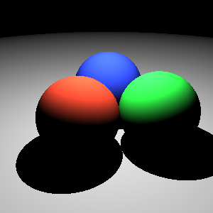
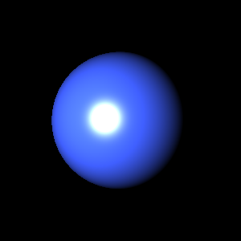

# PA1_2024 (Ray Tracing Algorithm)

## 1. Introduction
This project implements a basic **Ray Tracer** that supports:

- Spheres as geometric primitives
- Lambertian (diffuse) and Blinn-Phong (specular) shading models
- Point lights that do not attenuate with distance

The goal is to generate visually realistic images using simple and efficient ray tracing techniques. Although this implementation is not physically accurate, it produces clean and convincing results.

## 2. Environment   
- Language : Python
- Tool : Numpy, PIL

## 3. Workflow   
1. **Scene File Parsing**  
   The program reads a well-formed scene description file. This file defines:
   - Camera parameters
   - A list of spheres with their positions, radii, and material properties
   - Point light sources (with no attenuation)
   - The shading model to be applied (Lambertian or Blinn-Phong)

2. **Ray Generation**  
   Rays are generated from the camera through each pixel in the image plane. Each ray represents the path of light entering the virtual camera.

3. **Ray-Sphere Intersection Testing**  
   For every ray, the program checks for intersections with all spheres in the scene. If an intersection is found, the closest one is selected as the point of interest.

4. **Shading Calculation**  
   Depending on the selected shading model:
   - **Lambertian Shading** computes the diffuse color based on the angle between the surface normal and the light direction.
   - **Blinn-Phong Shading** adds specular highlights by considering the viewer direction and the halfway vector between light and view directions.
   Lighting is calculated using **point lights that do not attenuate with distance**, as specified in the assignment.

5. **Pixel Color Assignment**  
   The final color for each pixel is determined by the shading result and stored in an image buffer.

6. **Image Output**  
   Once all pixels are processed, the image buffer is saved as an output file in `.png` format.

## 4. How to run   
Move into PA1_2024 file
`cd ./CGAssignment/PA1_2024`   

**For Phong Shading**
`python rayTracer.py ./scenes/one-sphere.xml`

**For Lambertian Shading**
`python rayTracer.py ./scenes/four-spheres.xml`

## 5. Results

**Lambertian Shading Example**   

**Phong Shading Example**   

